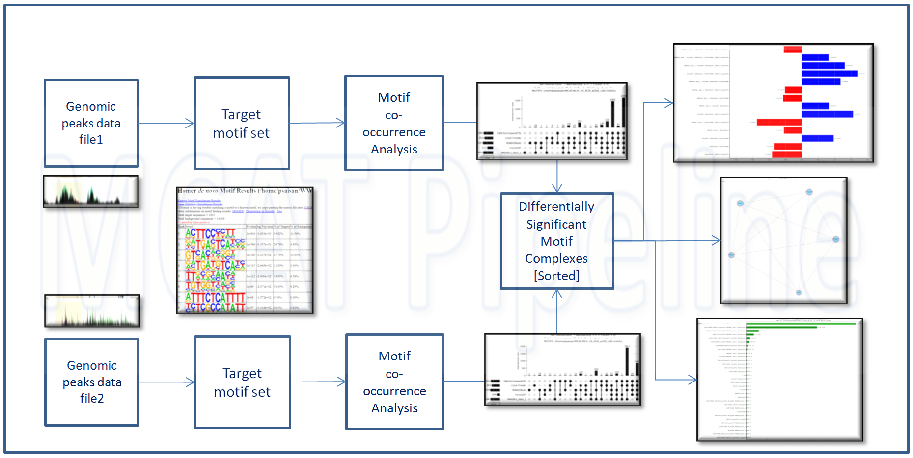

**Archive under active changes, temporarily offline**

---

**MCAT** : Motif Co-occurence Analysis Tool

#



## Abstract

Understanding gene regulation requires exploring complex genomic sequence structures beyond individual transcription factor motifs. **MCAT** is a software tool that enables the discovery and quantification of motif co-occurrences within regulatory sequences and performs differential analysis of motif complexes across distinct experimental conditions. Unlike high-complexity machine learning approaches, MCAT measures are straightforward and interpretable to minimize computational overhead and user background requirements. The motif co-occurrence constructs parallel the simplicity and interpretability of motifs as co-occurrence of individual nucleotides, representing a logical and natural progression of well-established pioneering genomic motif discovery tools like [HOMER](http://homer.ucsd.edu/homer/) and [FIMO](https://meme-suite.org/meme/tools/fimo).


## Citation   

If you use MCAT in your work, please reference it as follows:

Saisan, P., & Glass, C. (2024). *MCAT: Motif Co-occurrence Analysis Tool* (Version 1.0) [Computer software]. GitHub repository: https://github.com/psaisan/MCAT; Zenodo. https://doi.org/10.5281/zenodo.1234567


### BibTeX Entry

```bibtex
@misc{saisan2024MCAT,
  author       = {Saisan, P. and Glass, C.},
  title        = {MCAT: Motif Co-occurrence Analysis Tool},
  year         = {2024},
  publisher    = {GitHub},
  howpublished = {\url{https://github.com/psaisan/MCAT}},
  version      = {1.0},
}
```
